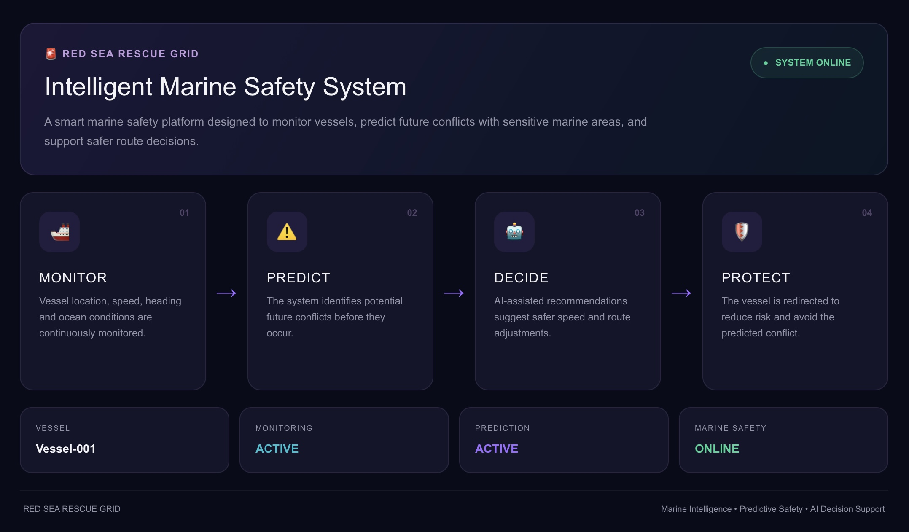
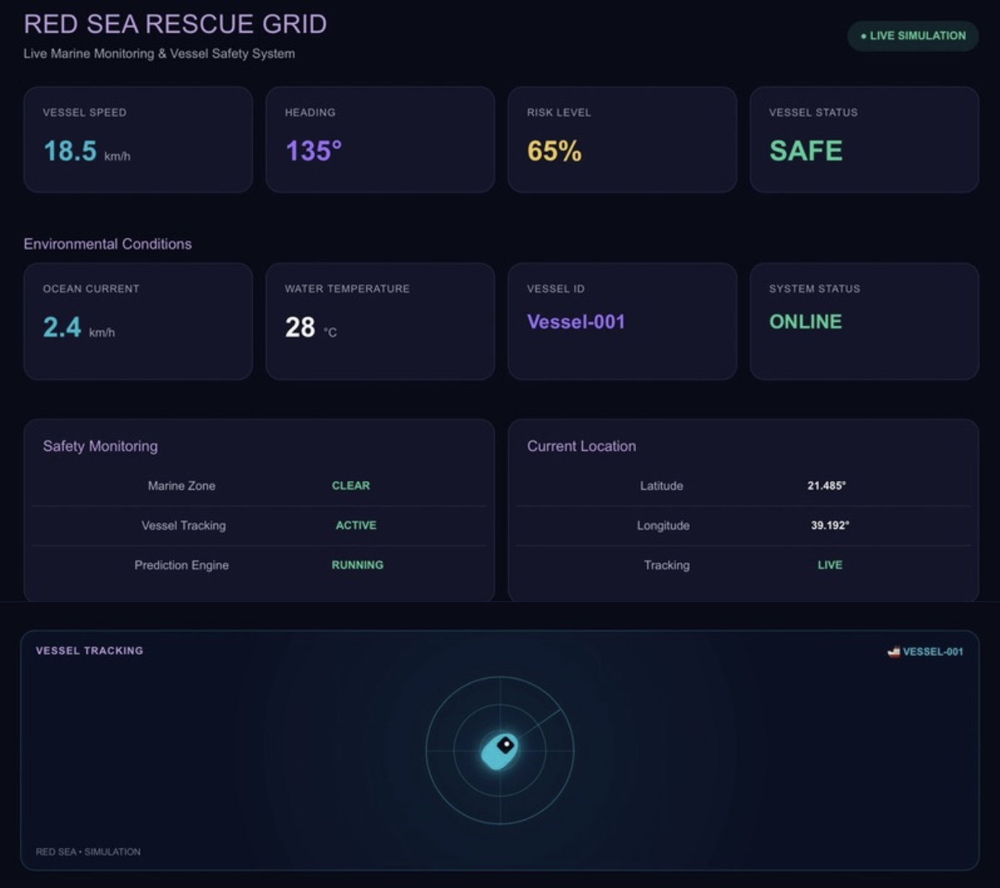
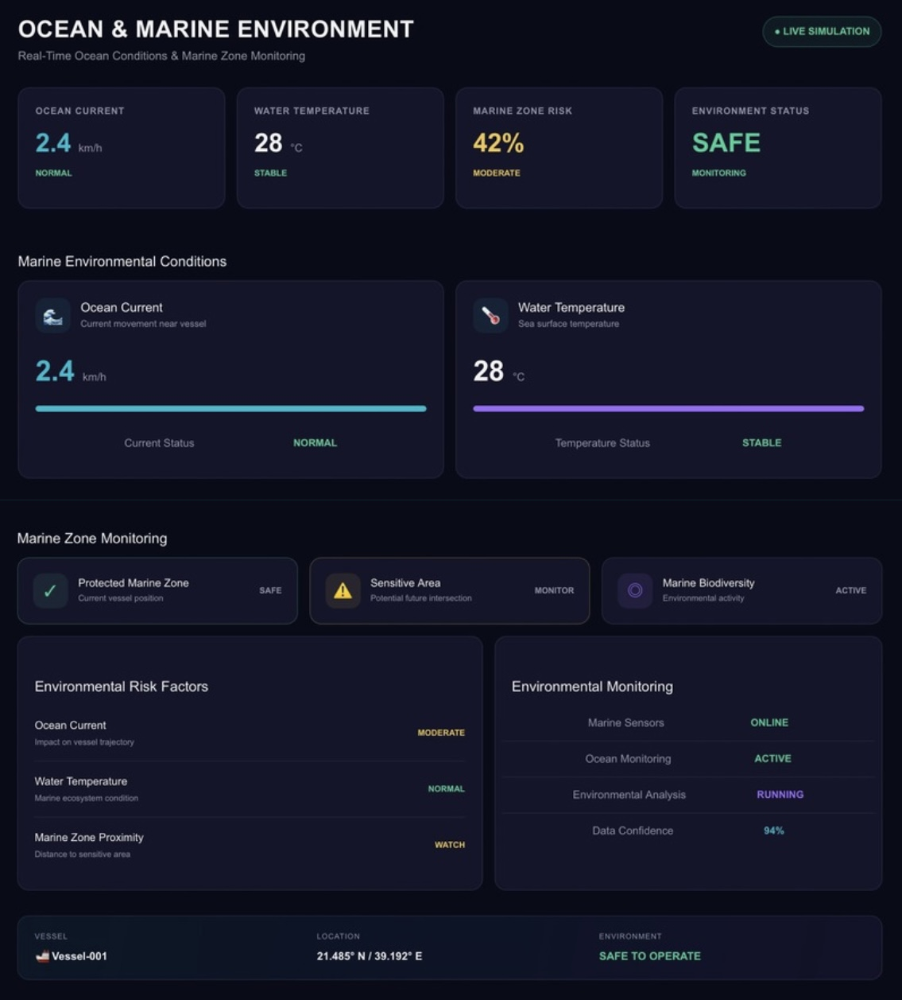
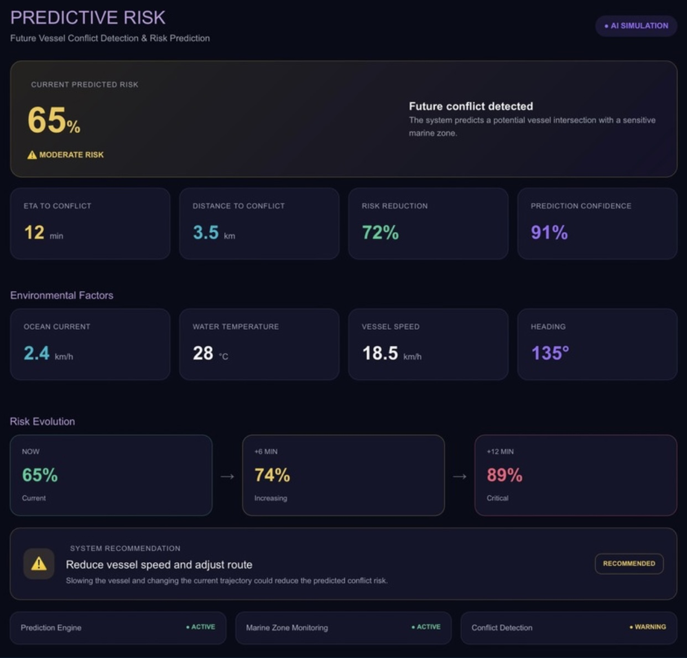
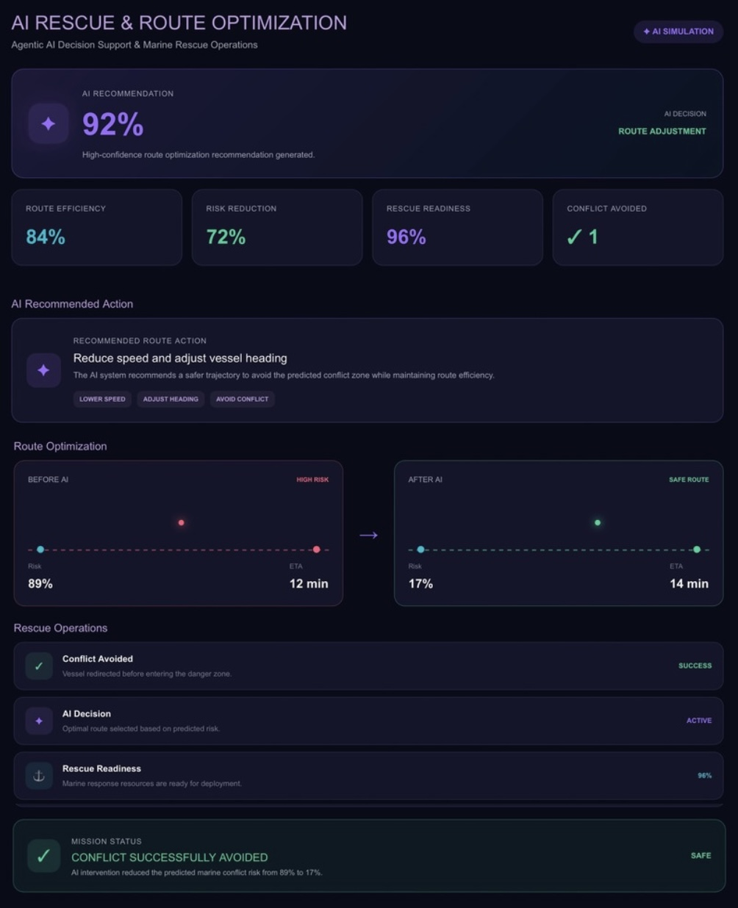

# RED SEA RESCUE GRID 🚨🌊

## Predictive Maritime Safety & Marine Environment Monitoring

RED SEA RESCUE GRID is an IoT-based maritime safety project designed to monitor vessel movement, analyze marine conditions, and support early detection of potential risks near sensitive marine areas in the Red Sea.

The project was developed using **Cumulocity IoT** to simulate vessel telemetry, visualize real-time maritime data, build predictive-risk workflows, and provide operational dashboards for maritime monitoring.

---

# 🎯 Project Objective

The main objective of RED SEA RESCUE GRID is to create a smart maritime monitoring system that can:

- 🚢 Monitor vessel movement in real time
- ⚡ Track vessel speed and heading
- 📍 Monitor vessel position
- 📊 Analyze incoming IoT telemetry
- 🌊 Monitor marine and environmental conditions
- ⚠️ Identify potential maritime risks
- 🔔 Support early risk awareness
- 📈 Provide operational and analytical dashboards
- 🧭 Support safer vessel route decisions

---

# 🏗️ System Architecture

```text
                    RED SEA RESCUE GRID
                           │
                           ▼
                ┌─────────────────────┐
                │   Vessel Simulator  │
                │        🚢           │
                └──────────┬──────────┘
                           │
                           ▼
                      Vessel-001
                           │
                           ▼
                ┌─────────────────────┐
                │   Cumulocity IoT    │
                └──────────┬──────────┘
                           │
          ┌────────────────┼────────────────┐
          │                │                │
          ▼                ▼                ▼
     Dashboards      Analytics Builder   Alarms &
                                           Events
                           │
                           ▼
                ┌─────────────────────┐
                │ Red Sea Predictive  │
                │        Risk         │
                └──────────┬──────────┘
                           │
                           ▼
                    Risk Monitoring
                           │
                           ▼
                  Alerts & Decisions

```
📊 Cumulocity IoT Dashboards

Five dashboards were developed to provide different operational, environmental, predictive, and decision-support views of the Red Sea Rescue Grid.

🚨 1. Overview

The main dashboard provides a high-level view of the overall system.

Purpose

Monitor the overall maritime situation
Provide key operational indicators
Present the system’s main status
Support rapid situational awareness
Monitoring Concept

MONITOR → PREDICT → DECIDE → PROTECT




🚢 2. Live Marine Monitoring

This dashboard focuses on real-time vessel and marine activity.

Purpose

Monitor vessel activity
Track vessel movement
View current vessel telemetry
Support real-time maritime awareness
Main Data

Vessel speed
Vessel heading
Vessel position
Current marine activity

🌊 3. Ocean & Marine Environment

This dashboard focuses on marine and environmental conditions.

Purpose

Monitor marine environmental information
Provide awareness of surrounding ocean conditions
Support understanding of environmental factors affecting maritime activity
Concept

Ocean Conditions → Marine Awareness → Safer Decisions


⚠️ 4. Predictive Risk

This dashboard focuses on identifying and monitoring potential maritime risks.

Purpose

Monitor current risk indicators
Support predictive risk analysis
Display risk-related information
Provide early-warning awareness
The dashboard is connected conceptually to the Red Sea Predictive Risk Analytics Builder workflow.

Concept

Detect → Analyze → Predict → Alert


🤖 5. AI Rescue & Route Optimization

This dashboard focuses on intelligent decision support for maritime safety and rescue operations.

Purpose

Support safer route decisions
Provide rescue-oriented information
Help identify potentially safer vessel paths
Support future AI-assisted maritime decision making
Concept

AI Analysis → Route Optimization → Rescue Readiness



🧠 Analytics Builder

A predictive-risk workflow was created using Cumulocity Analytics Builder.

Model

Red Sea Predictive Risk

The model is designed to process incoming vessel data and support predictive risk evaluation.

Workflow Components

Measurement Input
Position Input
Calculation
Logic
Flow Manipulation
Output
Conceptual Processing Flow

Vessel Telemetry
       │
       ▼
Measurement / Position Input
       │
       ▼
   Calculation
       │
       ▼
      Logic
       │
       ▼
 Risk Evaluation
       │
       ▼
Monitoring / Alert
🌊 Red Sea Safety Concept

The project focuses on the relationship between maritime vessel movement and sensitive marine areas.

The core concept combines:

Speed + Heading + Position

with marine and environmental information to identify situations that may require early attention.

The target is to support predictive monitoring approximately 10–15 minutes ahead, depending on the available data and simulation conditions.

🔄 Data Flow

Simulated Vessel
       │
       ▼
Speed / Heading / Position
       │
       ▼
Cumulocity IoT
       │
       ▼
Real-Time Telemetry
       │
       ▼
Analytics Builder
       │
       ▼
Predictive Risk Evaluation
       │
       ▼
Dashboards
       │
       ▼
Alerts & Decision Support
🛠️ Technology Stack

Technology

Purpose

Cumulocity IoT

IoT platform, device management, telemetry and monitoring

Analytics Builder

Data processing and predictive-risk workflow

IoT Device Simulator

Simulated maritime vessel telemetry

Dashboards

Real-time visualization and operational monitoring

Alarms & Events

Risk and operational notifications

GitHub

Version control and project documentation

🔐 Security

No Cumulocity credentials, passwords, API tokens, tenant secrets, or private authentication information should be uploaded to this repository.

Sensitive configuration should remain local or be stored securely using environment variables.

🚀 Future Improvements

Integrate real AIS vessel data
Add real-time weather data
Integrate ocean-current information
Add geofenced sensitive marine areas
Improve vessel trajectory prediction
Add automated risk severity levels
Expand predictive analytics
Integrate AI agents for vessel and marine-life analysis
Develop intelligent route optimization
Connect the system to real maritime data sources
👩🏻‍💻 Author

Maryam Alnumani

BSc Management Information Systems

📌 Project Summary

RED SEA RESCUE GRID demonstrates how IoT telemetry, real-time monitoring, analytics, and predictive-risk concepts can be combined to create a smart maritime safety solution for the Red Sea.

The project connects:

Real-Time Data
      ↓
Analytics
      ↓
Risk Detection
      ↓
Dashboards
      ↓
Alerts
      ↓
Decision Support


⭐ Project Highlights

- 🌊 IoT-based maritime monitoring.
- 🚢 Simulated vessel telemetry.
- 📍 Real-time vessel tracking.
-  📊 Five Cumulocity IoT dashboards.
- 🧠 Analytics Builder predictive-risk workflow.
- ⚡ Vessel speed and heading monitoring.
- 📍 Position-based monitoring.
- 🌊 Marine and environmental monitoring.
- ⚠️ Risk visualization.
- 🔔 Early-warning concept.
- 🤖 AI-assisted rescue and route optimization concept.
- 🛡️ Designed for maritime safety and marine environmental protection.
